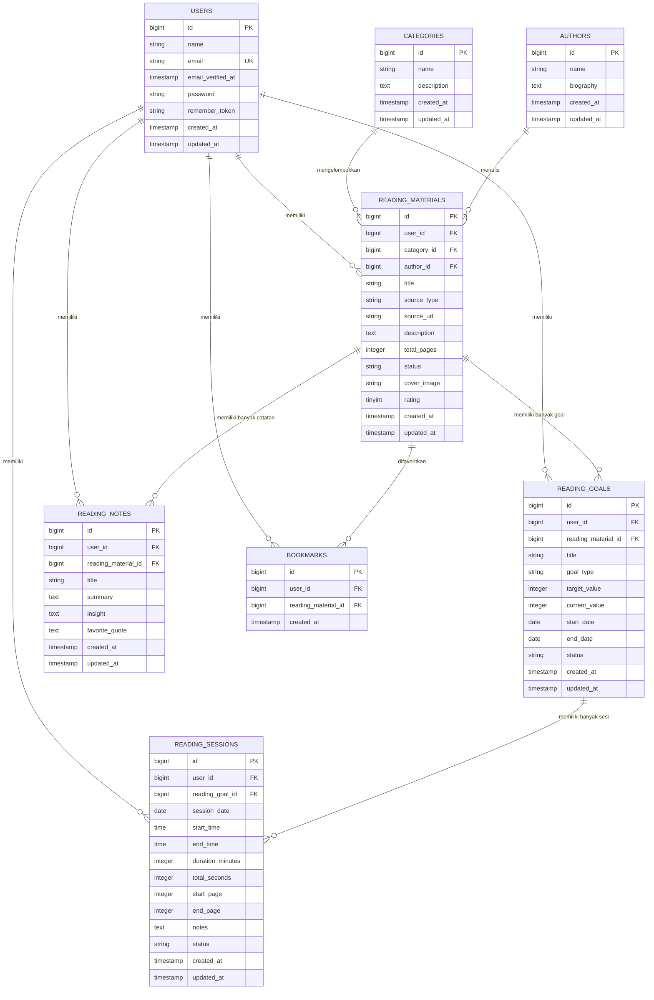

# LAPORAN APLIKASI READFLOW

**Aplikasi:** ReadFlow — Reading Tracker berbasis Web
**Framework:** Laravel 13 (PHP ^8.3)
**Environment:** Docker + Nginx + MySQL 8
**Pola Arsitektur:** MVC (Model–View–Controller)
**Status:** Sprint 5 Selesai (Stable)

---

## Daftar Isi

1. [Pendahuluan](#1-pendahuluan)
2. [SRS (Software Requirements Specification)](#2-srs-software-requirements-specification)
3. [Product Backlog](#3-product-backlog)
4. [ERD (Entity Relationship Diagram)](#4-erd-entity-relationship-diagram)
5. [FR (Functional Requirements)](#5-fr-functional-requirements)
6. [NFR (Non-Functional Requirements)](#6-nfr-non-functional-requirements)

---

## 1. Pendahuluan

### 1.1 Identitas Aplikasi

| Item | Keterangan |
|------|------------|
| Nama Aplikasi | ReadFlow |
| Jenis | Web-based Reading Tracker |
| Framework | Laravel 13, PHP ^8.3 |
| Database | MySQL 8 |
| Web Server | Nginx (via Docker) |
| Frontend | Blade + Vite |
| Repositori | https://github.com/amelars27/ReadFlow.git |

### 1.2 Tujuan

ReadFlow adalah aplikasi pencatat aktivitas membaca yang membantu pengguna mengelola buku/bahan bacaan, melacak kemajuan membaca, menetapkan target (goal) membaca, mencatat catatan baca, serta mengelola favorit (bookmark) dalam satu tempat.

### 1.3 Cara Menjalankan

1. `git clone https://github.com/amelars27/ReadFlow.git`
2. `cd ReadFlow`
3. `docker compose up -d`
4. `docker compose exec app bash`
5. `php artisan migrate`
6. Buka `http://localhost:8080`

---

## 2. SRS (Software Requirements Specification)

### 2.1 Deskripsi Umum Produk

ReadFlow merupakan sistem multi-user (per akun). Setiap pengguna memiliki data pribadi terpisah dan hanya dapat mengakses datanya sendiri (ownership check diterapkan pada seluruh fitur). Aplikasi mencakup fungsi utama:

- Manajemen bahan bacaan (katalog buku)
- Manajemen kategori dan penulis
- Penetapan target membaca (reading goals)
- Pencatatan sesi membaca lengkap dengan timer
- Pencatatan catatan baca
- Manajemen bookmark/favorit
- Dashboard statistik dan grafik aktivitas

### 2.2 Karakteristik Pengguna

| Tipe | Deskripsi |
|------|-----------|
| Tamu (Guest) | Belum login; hanya dapat membuka halaman autentikasi |
| Pengguna Terverifikasi | Pengguna yang telah mendaftar dan memverifikasi email; dapat mengakses seluruh fitur |
| Pemilik Data | Pengguna hanya dapat mengakses data yang dimiliki akunnya (owner-only) |

### 2.3 Lingkungan Operasional

- Sistem berjalan di dalam container Docker (`app`, `webserver`, `db`, `phpmyadmin`).
- Aplikasi diakses melalui browser pada `http://localhost:8080`.
- Database MySQL 8, phpMyAdmin tersedia pada `http://localhost:8081`.
- Dapat dijalankan lintas platform selama Docker tersedia.

### 2.4 Batasan (Constraints)

- Seluruh akses fitur utama mensyaratkan status `auth` dan email `verified`.
- Pengguna hanya dapat membuat **satu** sesi membaca aktif dalam satu waktu.
- Pengunggahan sampul buku dibatasi format `jpg, jpeg, png, webp` maksimal 2 MB.
- `end_page` sesi wajib lebih besar atau sama dengan `start_page`.
- Rating buku bernilai bilangan bulat (1–5).

### 2.5 Arsitektur Sistem

Struktur relasi utama (setelah refactor Sprint 4):

```
ReadingMaterial ──< ReadingGoal ──< ReadingSession
        │                 │
        └──< ReadingNote  └── belongsTo ReadingMaterial
        └──< Bookmark
```

> **Aturan penting:** `ReadingSession` TIDAK terhubung langsung ke `ReadingMaterial`. Akses material selalu melalui `readingGoal.readingMaterial`. Reading Goal adalah pemilik Reading Sessions; Reading Material hanyalah katalog.

### 2.6 User Stories

| Modul | User Story |
|-------|-----------|
| Autentikasi | Sebagai pengguna, saya dapat mendaftar, login, memverifikasi email, mereset kata sandi, dan mengelola profil saya. |
| Katalog | Sebagai pengguna, saya dapat menambah, melihat, mengubah, dan menghapus bahan bacaan beserta sampul dan rating-nya. |
| Kategori & Penulis | Sebagai pengguna, saya dapat mengelola kategori dan penulis untuk mengorganisasi katalog. |
| Goal | Sebagai pengguna, saya dapat menetapkan target membaca (buku/halaman/menit) beserta periode waktunya. |
| Sesi | Sebagai pengguna, saya dapat memulai, menjeda, melanjutkan, dan menyelesaikan sesi membaca dengan timer. |
| Catatan | Sebagai pengguna, saya dapat menulis catatan baca berisi ringkasan, insight, dan kutipan favorit. |
| Bookmark | Sebagai pengguna, saya dapat menandai buku sebagai favorit. |
| Dashboard | Sebagai pengguna, saya dapat melihat ringkasan statistik dan aktivitas membaca saya. |

---

## 3. Product Backlog

### 3.1 Riwayat Sprint (Selesai)

| Sprint | Fitur/Item | Status |
|--------|-----------|--------|
| Sprint 1 | Setup project awal, autentikasi (login/register/email verification), konfigurasi Docker | Selesai |
| Sprint 2 | CRUD Reading Material, CRUD Category, CRUD Author | Selesai |
| Sprint 3 | CRUD Reading Goal, CRUD Reading Notes | Selesai |
| Sprint 4 | Refactor arsitektur: ReadingSession dipindah dari ReadingMaterial ke ReadingGoal; "Start Reading" hanya dari Reading Goal | Selesai |
| Sprint 5 | Sinkronisasi Reading Goal & Session; progres goal otomatis via `MAX(end_page)`; perbaikan bug `elapsed_seconds`; perbaikan Dashboard relasi | Selesai |
| — | Fitur rating dipindah dari Reading Notes ke Reading Material | Selesai |
| — | Fix sinkronisasi bookmark dan tampilan sampul | Selesai |
| — | Redesign UI: katalog card, authors/categories card + search, reading notes card, font, warna, sidebar, layout sesi, dashboard welcome | Selesai |

### 3.2 Backlog Mendatang

| Prioritas | Item | Keterangan |
|-----------|------|-----------|
| Tinggi | Dashboard Analytics lanjutan | Reading statistics, total reading time, reading streak |
| Tinggi | Grafik aktivitas | Weekly activity, monthly activity, top categories, charts |
| Sedang | UI Enhancement lanjutan | Perbaikan spacing, shadow, tombol, responsivitas lebih lanjut |
| Sedang | Reading Summary | Ringkasan bacaan per periode |
| Rendah | Pemeliharaan dokumen | Perbarui `README.md` dan `PROJECT_SUMMARY.md` agar sinkron dengan status terbaru |

---

## 4. ERD (Entity Relationship Diagram)

### 4.1 Diagram Mermaid



### 4.2 Penjelasan Entitas

| Entitas | Atribut Utama | Keterangan |
|---------|--------------|-----------|
| `users` | id, name, email, email_verified_at, password | Data akun pengguna (default Laravel) |
| `categories` | id, name, description | Kategori bahan bacaan |
| `authors` | id, name, biography | Penulis bahan bacaan |
| `reading_materials` | id, user_id, category_id, author_id, title, source_type, source_url, description, total_pages, status, cover_image, rating | Katalog buku/bahan bacaan; `status` = Not Started / Reading / Completed; `source_type` = Book / Journal / Medium / Substack / Article / PDF |
| `reading_goals` | id, user_id, reading_material_id, title, goal_type, target_value, current_value, start_date, end_date, status | Target membaca; `goal_type` = books / pages / minutes; `status` = active / completed |
| `reading_sessions` | id, user_id, reading_goal_id, session_date, start_time, end_time, duration_minutes, total_seconds, start_page, end_page, notes, status | Sesi membaca; `status` = Active / Paused / Completed |
| `reading_notes` | id, user_id, reading_material_id, title, summary, insight, favorite_quote | Catatan baca per bahan bacaan |
| `bookmarks` | id, user_id, reading_material_id, created_at | Favorit; relasi many-to-many implisit via user |

### 4.3 Aturan Relasi

- Setiap entitas data di-*scope* oleh `user_id` (data pribadi per akun).
- `reading_materials.category_id` dan `reading_materials.author_id` adalah relasi wajib (cascade delete).
- `reading_goals.reading_material_id` → satu goal mengacu pada satu bahan bacaan.
- `reading_sessions.reading_goal_id` → sesi hanya milik satu goal (bukan langsung ke material).
- Penghapusan entitas induk (cascade) menghapus data turunannya.

---

## 5. FR (Functional Requirements)

### 5.1 Autentikasi & Profil

| Kode | Deskripsi |
|------|-----------|
| FR-01 | Sistem menyediakan pendaftaran pengguna baru. |
| FR-02 | Sistem menyediakan login dan logout pengguna. |
| FR-03 | Sistem mengirim email verifikasi dan mengharuskan verifikasi sebelum mengakses fitur utama. |
| FR-04 | Sistem menyediakan lupa kata sandi (reset via email). |
| FR-05 | Pengguna dapat mengubah informasi profil, kata sandi, dan menghapus akun. |

### 5.2 Reading Material (Katalog)

| Kode | Deskripsi |
|------|-----------|
| FR-06 | Pengguna dapat membuat bahan bacaan baru (judul, jenis sumber, URL, deskripsi, total halaman, estimasi waktu, status). |
| FR-07 | Pengguna dapat melihat detail bahan bacaan beserta penulis, kategori, dan status bookmark. |
| FR-08 | Pengguna dapat mengubah data bahan bacaan. |
| FR-09 | Pengguna dapat menghapus bahan bacaan. |
| FR-10 | Pengguna dapat mengunggah sampul buku (jpg/jpeg/png/webp, maks 2 MB). |
| FR-11 | Pengguna dapat memberikan rating buku (1–5). |
| FR-12 | Pengguna dapat mencari bahan bacaan berdasarkan judul atau nama penulis. |
| FR-13 | Pengguna dapat memfilter bahan bacaan berdasarkan kategori dan status. |
| FR-14 | Pengguna dapat memperbarui halaman saat ini; sistem mengubah status menjadi Reading atau Completed otomatis berdasarkan total halaman. |

### 5.3 Kategori & Penulis

| Kode | Deskripsi |
|------|-----------|
| FR-15 | Pengguna dapat membuat, melihat, mengubah, dan menghapus kategori. |
| FR-16 | Pengguna dapat mencari kategori berdasarkan nama. |
| FR-17 | Pengguna dapat membuat, melihat, mengubah, dan menghapus penulis. |
| FR-18 | Pengguna dapat mencari penulis berdasarkan nama. |

### 5.4 Reading Goal

| Kode | Deskripsi |
|------|-----------|
| FR-19 | Pengguna dapat membuat goal membaca (tipe books/pages/minutes, nilai target, periode tanggal). |
| FR-20 | Pengguna dapat melihat daftar goal beserta progres dan sesi terkait. |
| FR-21 | Pengguna dapat melihat detail goal lengkap dengan sesi selesai dan info material. |
| FR-22 | Pengguna dapat mengubah goal; sistem memvalidasi `current_value` tidak melebihi target dan mengubah status otomatis. |
| FR-23 | Pengguna dapat menghapus goal. |
| FR-24 | Progres goal dihitung otomatis dari `MAX(end_page)` seluruh sesi selesai (bukan penjumlahan halaman). |
| FR-25 | Goal otomatis berstatus `completed` ketika `end_page >= total_pages` material. |

### 5.5 Reading Session

| Kode | Deskripsi |
|------|-----------|
| FR-26 | Pengguna dapat memulai sesi membaca dari sebuah reading goal. |
| FR-27 | Sistem hanya mengizinkan satu sesi aktif per pengguna (mulai baru ditolak jika sudah ada sesi in-progress). |
| FR-28 | Pengguna dapat menjeda sesi; total waktu disimpan ke `total_seconds`. |
| FR-29 | Pengguna dapat melanjutkan sesi yang dijeda. |
| FR-30 | Pengguna dapat menyelesaikan sesi dengan mengisi halaman awal, halaman akhir, dan catatan. |
| FR-31 | Sistem memvalidasi `end_page >= start_page` saat menyelesaikan sesi. |
| FR-32 | Sistem menghitung `duration_minutes` dari `total_seconds` dan menyimpan `end_time`. |
| FR-33 | Sistem menampilkan sesi saat ini (in-progress) dan riwayat sesi terbaru. |
| FR-34 | Pengguna dapat membuat, mengubah, dan menghapus sesi secara manual (CRUD). |
| FR-35 | Pengguna hanya dapat mengakses sesi miliknya (403 jika bukan pemilik). |

### 5.6 Reading Note

| Kode | Deskripsi |
|------|-----------|
| FR-36 | Pengguna dapat membuat catatan baca (judul, ringkasan, insight, kutipan favorit) untuk sebuah bahan bacaan. |
| FR-37 | Pengguna dapat melihat daftar catatan dalam tampilan kartu modern. |
| FR-38 | Pengguna dapat melihat detail catatan. |
| FR-39 | Pengguna dapat mengubah catatan. |
| FR-40 | Pengguna dapat menghapus catatan. |

### 5.7 Bookmark

| Kode | Deskripsi |
|------|-----------|
| FR-41 | Pengguna dapat menandai bahan bacaan sebagai favorit (bookmark). |
| FR-42 | Pengguna dapat menghapus bookmark dari bahan bacaan. |
| FR-43 | Pengguna dapat melihat daftar bookmark beserta sampul buku. |
| FR-44 | Status bookmark tersinkronisasi antara halaman katalog dan halaman detail material. |

### 5.8 Dashboard

| Kode | Deskripsi |
|------|-----------|
| FR-45 | Sistem menampilkan total bahan bacaan, total sesi, total catatan, dan jumlah goal aktif. |
| FR-46 | Sistem menampilkan 5 sesi dan 5 catatan terbaru. |
| FR-47 | Sistem menampilkan daftar goal aktif beserta progres. |
| FR-48 | Sistem menampilkan rata-rata progres seluruh goal (persentase). |
| FR-49 | Sistem menampilkan jumlah bahan bacaan per kategori. |
| FR-50 | Sistem menampilkan grafik jumlah sesi 7 hari terakhir. |
| FR-51 | Sistem menampilkan pesan selamat datang yang personal di dashboard. |

### 5.9 Keamanan Akses (Cross-cutting)

| Kode | Deskripsi |
|------|-----------|
| FR-52 | Seluruh fitur utama hanya dapat diakses oleh pengguna yang login dan email terverifikasi. |
| FR-53 | Setiap operasi ubah/hapus data memverifikasi kepemilikan (`user_id`) dan menolak akses orang lain dengan status 403. |

---

## 6. NFR (Non-Functional Requirements)

### 6.1 Performa

| Kode | Deskripsi |
|------|-----------|
| NFR-01 | Waktu muat halaman utama berada dalam batas wajar (< 3 detik pada lingkungan lokal). |
| NFR-02 | Data dashboard (statistik, grafik, daftar terbaru) dihitung via query agregat yang efisien. |
| NFR-03 | Daftar data (katalog, goal, sesi, catatan) menggunakan paginasi untuk menghindari beban besar. |
| NFR-04 | Timer sesi membaca berjalan di sisi klien dan dikirim sebagai `elapsed_seconds` untuk akurasi durasi. |

### 6.2 Keamanan

| Kode | Deskripsi |
|------|-----------|
| NFR-05 | Kata sandi disimpan ter-hash (bcrypt via Laravel default). |
| NFR-06 | Setiap data di-*scope* per pengguna; akses data milik orang lain ditolak (403). |
| NFR-07 | Seluruh form memakai proteksi CSRF. |
| NFR-08 | Validasi input sisi server pada seluruh endpoint (Laravel FormRequest). |
| NFR-09 | Unggahan file divalidasi tipe dan ukurannya (max 2 MB, whitelist ekstensi). |
| NFR-10 | Tidak ada data sensitif (password, kredensial) yang diekspos di kode atau log. |

### 6.3 Usabilitas

| Kode | Deskripsi |
|------|-----------|
| NFR-11 | Tampilan responsif untuk berbagai ukuran layar. |
| NFR-12 | Navigasi sidebar dan topbar konsisten di seluruh halaman. |
| NFR-13 | Pesan sukses/error ditampilkan jelas kepada pengguna setelah setiap aksi. |
| NFR-14 | Desain modern dan konsisten (kartu, tipografi, palet warna) di seluruh modul. |
| NFR-15 | Halaman utama (katalog, penulis, kategori, catatan) menyediakan pencarian dan penyaringan. |

### 6.4 Reliabilitas

| Kode | Deskripsi |
|------|-----------|
| NFR-16 | Data tersimpan persisten di volume Docker (`db_data`). |
| NFR-17 | Migrasi database bersifat incremental dan dapat di-*rollback*. |
| NFR-18 | Perubahan skema (refactor) tidak menghapus fungsi bisnis yang sudah stabil. |
| NFR-19 | Seluruh state disimpan di server sehingga sinkron antar perangkat. |

### 6.5 Maintainability

| Kode | Deskripsi |
|------|-----------|
| NFR-20 | Kode mengikuti pola MVC; controller, model, request, dan view terpisah sesuai tanggung jawab. |
| NFR-21 | Business logic (progres goal, durasi sesi) terkonsentrasi di controller/model agar mudah diuji. |
| NFR-22 | Arsitektur relasi terdokumentasi (dilarang menambah relasi langsung Session→Material). |
| NFR-23 | Perubahan dikerjakan dalam unit kecil: satu tujuan → implementasi → tes → commit. |

### 6.6 Kompatibilitas & Portabilitas

| Kode | Deskripsi |
|------|-----------|
| NFR-24 | Aplikasi berjalan di dalam container Docker (app, Nginx, MySQL, phpMyAdmin). |
| NFR-25 | Kode bersifat portabel: environment via `.env` dan konfigurasi container. |
| NFR-26 | Menggunakan versi dependensi modern (Laravel 13, PHP ^8.3) sesuai ekosistem. |

---

*Dokumen ini disusun berdasarkan implementasi ReadFlow saat ini (Sprint 1–5). Skema dan aturan bisnis diambil dari migration, model, dan controller yang ada di dalam repositori.*
